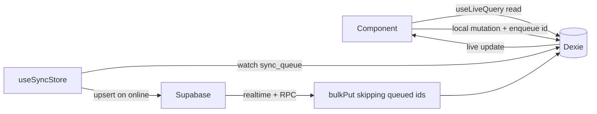
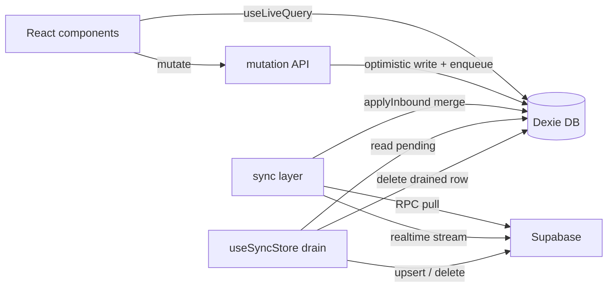

## Goals

- One IndexedDB layer (Dexie) for: cached `lists`, `list_detail` (items, members, item_member_state), per-list prefs, outbox mutations, offline-route markers, and metadata (active user, recent lists, label filter).
- UI subscribes directly to Dexie via `useLiveQuery`; a sync layer mirrors Supabase to Dexie (RPC + realtime) and drains the outbox.
- PWA powered by Serwist with a custom `sw.ts`, a `manifest.ts` via Next Metadata API, and the same offline-readiness message protocol as today.
- `localStorage` keeps only small UI flags.
- **Client-generated UUIDs everywhere**: every newly created entity (lists, items, members, IMS rows) gets a real `crypto.randomUUID()` at creation time and that id is sent to Supabase; the server stores the client-supplied id. This removes the temp-id concept and the atomic id-remap step entirely, simplifying both the sync queue and the connectivity UX.

## What stays in localStorage

Required (per task):
- `darkMode` (theme) - already managed by `next-themes`; unchanged.
- `seenTutorial` flags (`tutorial_*`, `tutorial_*_targets`) in `[src/components/ui/TutorialTour.tsx](src/components/ui/TutorialTour.tsx)`.

Recommended additional allowlist (small, sync-read at boot; can be dropped if you prefer strict two-flag rule):
- `pwa-install-dismissed` in `[src/components/ui/InstallBanner.tsx](src/components/ui/InstallBanner.tsx)`.
- `DEBUG_PWA`, `DEBUG_STARTUP` in `[src/lib/pwaDebug.ts](src/lib/pwaDebug.ts)` and `[src/lib/startupDiagnostics.ts](src/lib/startupDiagnostics.ts)`.
- `CONNECTIVITY_STATUS_KEY` in `[src/providers/ConnectivityProvider.tsx](src/providers/ConnectivityProvider.tsx)` (sync read at boot before async DB init).

Everything else moves to Dexie.

## How it works (offline-first model)

- Reads: components call `useLiveQuery(() => db.items.where({ listId }).filter(r => r.deleted_at == null).toArray())` (or equivalent). Near-instant because it hits local IndexedDB; results auto-update on any write. **Soft-deleted rows are excluded.**
- Writes: hooks (e.g. `useToggleItem`, `addItem`, `patchItem`) write only to Dexie. In the same transaction, the row's id is added to `sync_queue`. UI reflects the change immediately because the same Dexie tables drive the live query.
- Soft deletes: `deleteList`, `deleteItem`, `deleteMember`, etc. set `deleted_at = Date.now()` on the Dexie row (the row stays in IndexedDB as a tombstone) and enqueue a `kind: 'delete'` sync_queue entry. The UI hides the row immediately; the actual hard delete happens once the server confirms.
- Sync engine (`useSyncStore`): a single root-level hook watches `sync_queue` plus connectivity. When online, it pushes each entry to Supabase. On success of a `kind: 'delete'` entry, it hard-removes the Dexie row in a transaction with the queue cleanup. On permanent failure (e.g. RLS denial), it restores the row (`deleted_at = null`) and surfaces an error.
- Inbound from Supabase: on app mount and on realtime events, RPC results are written via `db.<table>.bulkPut()` - field-level rebased against any rows still in `sync_queue` so we never clobber unsynced local edits. Server-confirmed deletes (realtime DELETE events, or rows missing from a fresh pull) hard-remove the Dexie row.
- Why this wins: with no signal, the user can still toggle 20 items, add new ones, delete a few, edit names; everything queues in `sync_queue` and shows the pending state immediately. When connectivity returns, `useSyncStore` drains it to Supabase. UI never blocks on the network.



## Architecture



## Dexie schema (v1)

New file `[src/lib/db.ts](src/lib/db.ts)` using `Dexie` + `EntityTable` (typed) and `db.version(1).stores(...)`:

Concrete Dexie schema (every `deleted_at` field is indexed so live queries that filter `deleted_at == null` never scan tombstones):

```ts
db.version(1).stores({
  lists:              '&[userId+id], userId, userArchived, sort_order, deleted_at',
  listDetails:        '&[userId+listId], userId, listId, cachedAt, deleted_at',
  items:              '&[userId+listId+id], [userId+listId], list_id, archived, sort_order, category, deleted_at',
  members:            '&[userId+listId+id], [userId+listId], list_id, sort_order, deleted_at',
  item_member_state:  '&[listId+item_id+member_id], [listId+item_id], [listId+member_id], item_id, member_id, deleted_at',
  listPrefs:          '&[userId+listId]',
  sync_queue:         '&[listId+itemKey], listId, kind, updatedAt',
  offlineRouteMarkers:'&[userId+listId+buildId], [userId+listId], buildId',
  meta:               '&key',
})
```

- `lists`: mirrors `ListWithRole` + `cachedAt` + `deleted_at: number | null`.
- `listDetails`: denormalized list row + `cachedAt`/`schemaVersion` for instant first paint.
- `items`: mirrors the `items` row only (no embedded member states).
- `members`: mirrors `MemberWithCreator`.
- `item_member_state`: per-(item, member) state. Composite primary key so toggling an item targets exactly one row and produces a single matching `sync_queue` entry.
- `listPrefs`: per-list UI prefs (replaces `list_<u>_<id>_prefs`).
- `sync_queue`: queued local mutations awaiting Supabase (replaces the raw outbox). Composite-key entries (`ims:<item_id>:<member_id>`, `mbr:<member_id>`, `list`, `item:<id>`, `member:<id>`) survive unchanged from the existing outbox key scheme.
- `offlineRouteMarkers`: replaces `[src/lib/offlineRouteReadiness.ts](src/lib/offlineRouteReadiness.ts)`.
- `meta`: keyed by `key` -> `{ activeUserId, recentLists, labelFilter, migrationVersion, pendingInviteToken }`.

Every entity table includes `deleted_at: number | null` (set to `Date.now()` on local soft-delete, `null` otherwise) and is indexed on it so live queries filter tombstones cheaply.

`db.version(1)` is final for now; future shape changes bump to `version(2).upgrade(...)`.

## Hydration + SSR (fast-path render, skeleton only when truly empty)

- Primary check: `useLiveQuery(query, deps)` returns `undefined` until the first IndexedDB read resolves. Components render a skeleton **only while `data === undefined`**, not for a fixed hydration window.
  - On warm visits Dexie typically resolves within a few ms, so the skeleton flashes briefly or not at all -> "instant" PWA feel preserved.
  - On a cold visit with no cached data, the skeleton stays until the first Supabase pull completes (same UX as today).
- New `[src/hooks/useHasHydrated.ts](src/hooks/useHasHydrated.ts)`: kept as a backstop for components that would *crash* on SSR (e.g. anything that touches `indexedDB` synchronously at render). Returns `false` on server, `true` after first effect on client. Used sparingly; do **not** use it as the default skeleton gate.
- All Dexie access is gated by `typeof window !== 'undefined'`; the data API returns `undefined` (not empty arrays) on the server so live queries can distinguish "loading" from "empty".
- Hooks/components touching Dexie keep `'use client'`.

## Data layer (Dexie-first)

New `src/lib/data/`:
- `queries.ts`: `useListsQuery(userId)`, `useListDetailQuery(userId, listId)`, `useListPrefsQuery(...)`, `useSyncQueueBadge()`.
  - All implemented via `useLiveQuery` from `dexie-react-hooks`.
  - `useListDetailQuery(userId, listId)` performs an **in-memory join** inside the live query callback so item components see a single shaped `ItemWithState`-like result:
    ```ts
    useLiveQuery(async () => {
      const [items, members, states] = await Promise.all([
        db.items.where({ userId, listId }).sortBy('sort_order'),
        db.members.where({ userId, listId }).sortBy('sort_order'),
        db.item_member_state.where('[listId+item_id]').between([listId, Dexie.minKey], [listId, Dexie.maxKey]).toArray(),
      ])
      const byItem = new Map<string, Record<string, ItemMemberState>>()
      for (const s of states) {
        const m = byItem.get(s.item_id) ?? {}
        m[s.member_id] = s
        byItem.set(s.item_id, m)
      }
      const itemsWithState: ItemWithState[] = items.map(i => ({ ...i, memberStates: byItem.get(i.id) ?? {} }))
      return { items: itemsWithState, members }
    }, [userId, listId])
    ```
    The join runs on every relevant change (Dexie auto-tracks the touched tables) and is fast because it is in-memory.
- `mutations.ts`: `createList`, `updateList`, `deleteList`, `addItem`, `toggleItem`, `patchItem`, `setItemMemberState`, `changeQuantity`, `addMember`, `patchMember`, `deleteItem`, `deleteMember`, etc.
  - Each mutation: a single `db.transaction('rw', ...)` that (a) applies the optimistic change to the right Dexie table and (b) writes/merges a `sync_queue` row keyed at the right granularity using the LWW merge logic ported from `[src/lib/itemMutationOutbox.ts](src/lib/itemMutationOutbox.ts)`.
  - **All ids are client-generated UUIDs**: every `create*` / `add*` mutation calls `crypto.randomUUID()` for the new row's `id`. Both Dexie and Supabase store the same UUID, so foreign keys (`item_member_state.item_id`, `item_member_state.member_id`, etc.) are stable from the moment the row is created and require **no remapping** when the queued create eventually drains.
  - Toggle/quantity (per-member edits): the mutation writes the **`item_member_state`** row keyed by `[listId+item_id+member_id]` and enqueues exactly one `sync_queue` entry with `kind: 'itemMemberState'` and itemKey `ims:<item_id>:<member_id>` (matches existing `itemMemberStateOutboxKey`). It does **not** rewrite the parent `items` row.
  - Create-with-states (offline new item): the mutation inserts the new `items` row (with the client UUID) plus one `item_member_state` row per target member in the same transaction, and enqueues a single `kind: 'create'` `sync_queue` entry whose payload carries that UUID and the per-member states (already supported by `QueuedCreateRecord.payload.memberStates`). When drain succeeds, the row in `sync_queue` is simply deleted - no id swap, no FK rewrite.
  - **Soft delete (all delete mutations)**: `deleteList` / `deleteItem` / `deleteMember` / `setItemMemberState({ remove: true })` do **not** call `db.<table>.delete(...)`. They set `deleted_at = Date.now()` on the Dexie row and enqueue a new `kind: 'delete'` `sync_queue` entry (one entry per row), all in the same `db.transaction('rw', ...)`. Live queries filter `deleted_at == null` so the UI hides the row instantly; the row remains as a tombstone until drain confirms the Supabase delete.
  - **Cascade for parent soft-deletes**: `deleteList` also soft-deletes the children (`items`, `members`, `item_member_state` for the list) in the same transaction so the UI is immediately consistent. Children **do not** get individual `kind: 'delete'` queue entries - the server's `ON DELETE CASCADE` handles them; only the list-level delete is queued. After drain confirms the list delete, inbound sync hard-removes any remaining child rows.
  - **Edits to soft-deleted rows are rejected** at the mutation API entry; the UI never offers them because the rows are filtered out of live queries, but a defensive guard prevents races.
  - **Local-only deletes** (rows that were never synced - i.e. they have a pending `kind: 'create'` in `sync_queue`): the create entry is removed and the row is hard-deleted from Dexie immediately; no `kind: 'delete'` entry is enqueued, since the server never knew about it.
- `sync.ts` (Supabase inbound, with LWW merge rule):
  - `syncLists(userId)` -> `supabase.rpc('get_user_lists')` -> `applyInbound('lists', rows)`.
  - `syncListDetail(userId, listId)` -> `supabase.rpc('get_list_data')` -> `applyInbound('items'|'members'|'listDetails', rows)`.
  - `subscribeRealtime(userId)` -> existing channel logic; on event, debounced re-pull through the same `applyInbound` path.
- `applyInbound(table, rows)` (the data-safety skip rule, refined to LWW merge):
  ```
  for incoming in rows:
    queued = sync_queue.get([listId, keyFor(incoming)])
    if !queued:
      table.put(incoming)              // common case: no conflict
    else if queued.kind === 'delete':
      // local pending delete wins; keep the tombstone, ignore the server row
      continue
    else:
      // field-level rebase: server is the new base, queued patch wins on touched fields
      base = incoming
      merged = applyQueuedPatch(base, queued)   // reuses mergeRecords logic
      table.put(merged)                          // queue row stays; drain will push it
      // for `create` queued rows where no server row exists yet, just keep local; do not overwrite
  ```
  This matches the requested rule: `if (queue.has(id)) merge(incoming, local) else bulkPut(incoming)`, and never overwrites a more recent, unsynced local edit.
- **Server-confirmed deletes (inbound)**: realtime DELETE events and rows that disappear between RPC pulls trigger a hard-delete in Dexie, **except** when there is a pending `kind: 'create'` for the same id in `sync_queue` (the server hasn't seen our row yet) - in that case we leave the local row alone.
- `migrate.ts`: one-time legacy migration on first run.

## useSyncStore (background sync layer)

New `[src/hooks/useSyncStore.ts](src/hooks/useSyncStore.ts)` mounted once at the root (e.g. inside `[src/providers/ConnectivityProvider.tsx](src/providers/ConnectivityProvider.tsx)` or its parent layout):

- Watches the `sync_queue` table via `useLiveQuery` and the existing `useConnectivity()` online/offline signal.
- Drain loop (only runs while online and not already draining):
  1. Read pending rows ordered by drain-priority (ports `sortPendingForDrain` from `[src/lib/itemMutationOutbox.ts](src/lib/itemMutationOutbox.ts)`); deletes drain after creates/edits for the same id so we never delete a row before its create has reached the server.
  2. For each row, call the matching Supabase op. Because the client already chose the UUID at create time, every call passes `id` (or `p_id`) and the server stores it; nothing comes back that needs to overwrite the local id.
     - `kind: 'create' | 'patch* | 'itemMemberState' | 'addMember'`: `items.upsert({ id, list_id, ... })`, `members.upsert(...)`, `item_member_state.upsert(...)`, RPC calls pass `p_id`.
     - `kind: 'delete'`: `from(<table>).delete().eq('id', id)` (or composite-eq for `item_member_state`).
  3. On success of a non-delete: delete the drained row from `sync_queue` in a single `db.transaction('rw', sync_queue, ...)`. Because ids are stable, no FK rewrite or dependent-row patch is needed.
  4. On success of a delete: in one `db.transaction('rw', <entity table>, sync_queue, ...)`, hard-remove the Dexie tombstone row (the one with `deleted_at != null`) and remove the sync_queue entry. For list-level deletes, also hard-remove all child tombstones (items / members / item_member_state for that list) in the same transaction; the server's cascade has already removed them.
  5. **Single-transaction safety**: every drain step runs inside one `db.transaction('rw', items, members, item_member_state, sync_queue, lists, listDetails, ...)` so live-query observers never see a half-applied state if the page closes mid-drain.
  6. On connectivity error: stop the loop; resumes on the next `markOnlineRecovered` from `useConnectivity` (primary trigger).
  7. On application error (e.g. RLS denial, unique violation): keep the queue row but flag it (`lastError`, `attemptCount`) so the UI can surface it; **for a `kind: 'delete'` failure, also restore the entity row by setting `deleted_at = null`** so the UI shows it again with an error toast. No infinite retry loop.
- Exposes `{ pendingCount, isDraining, lastError }` for the connectivity/diagnostics UI.

## Sync failure UX (restore + surface)

Two failure classes, two different reactions:

- **Connectivity failure** (network, Supabase 5xx, timeout): the queue entry stays, drain backs off, the optimistic local change remains visible. No UI alarm; the existing connectivity indicator already shows "syncing" / "offline".
- **Application failure** (RLS denial, validation error, unique violation, foreign-key error): the local optimistic change must be reverted and the user must be told. Behaviors per kind:
  - `kind: 'delete'` -> in one transaction, set `deleted_at = null` on the entity row(s) and remove the queue entry. The row reappears in the UI; an inline error toast says e.g. "Couldn't delete 'Milk' - permission denied."
  - `kind: 'patch*' | 'itemMemberState' | 'patchMember'` -> remove the queue entry and immediately re-pull the affected row from Supabase via `applyInbound`. Because the server is the source of truth, the row resets to the server state, which effectively reverts the local optimistic edit. Toast: "Couldn't save change to ... - server rejected it."
  - `kind: 'create'` -> remove the queue entry and hard-delete the local row (it never existed on the server). Toast: "Couldn't create ... - server rejected it."
- **Per-row error indicator**: when a queue entry has `attemptCount > 0 && lastError`, the live query joins it onto the entity row so list-detail rows can render a small "sync failed" badge next to the affected row until it succeeds or is reverted. Tapping the badge surfaces the full error.
- **Global indicator**: `useSyncStore` exposes `lastError` and a derived `hasSyncFailures` flag; the existing connectivity indicator gains a "Sync issue" state that links to a diagnostics panel listing failing queue entries.
- **User-initiated retry**: the diagnostics panel offers "Retry" (re-runs the queue entry) and "Discard" (treats it as a permanent failure and runs the revert path above).

Concrete example: a `Make Private` action fails server-side because the user's role isn't `owner`. The queue entry's `lastError` is set, the local `lists` row is reverted via `applyInbound`, the connectivity indicator shows "Sync issue", and a toast explains why collaborators reappeared.

## Tombstone garbage collection

Tombstones (rows with `deleted_at != null`) accumulate when a delete drains successfully (then they are hard-removed by the drain) or when a delete fails permanently (then they are restored by the failure path above). The case to watch is partial drains: a tombstone whose drain never runs (sign-out while offline, app uninstalled and reinstalled, etc.).

GC strategy:
- Each Dexie open runs a one-shot pass: `db.<entity>.where('deleted_at').above(0).and(r => r.deleted_at < Date.now() - THIRTY_DAYS).delete()`. The `deleted_at` index makes this a cheap bounded query.
- Additionally, the legacy localStorage migration step (one-shot on first load) clears any tombstones it encounters in the imported data older than 30 days.
- The post-login successful-drain hook also runs the same pass so tombstones are reaped opportunistically once we know the device is online.
- Threshold lives in `src/lib/data/gc.ts` as `TOMBSTONE_TTL_MS`; default `30 * 24 * 60 * 60 * 1000`.

## Connectivity integration (offline / recovery / online preserved)

The existing `[src/providers/ConnectivityProvider.tsx](src/providers/ConnectivityProvider.tsx)` lifecycle stays unchanged in shape; signals are rewired to the new layer:

- `canMutateNow` / `tryBeginMutation` / `mutationGate` -> still gate UI mutation entry points; mutations themselves now write Dexie + `sync_queue` (so they succeed offline and don't depend on this gate, but the gate still prevents user-confusing concurrent flows).
- `enterOffline(reason)` -> pauses `useSyncStore` drain and inbound sync; UI keeps reading Dexie.
- `markOnlineRecovered(reason)` -> kicks `useSyncStore` drain, then triggers `applyInbound` re-pulls.
- `recoveryFetchGeneration` -> bumps an inbound-sync generation; `useLists` / `useList` start a refresh through `applyInbound` (same as today, but now landing in Dexie, not React state).
- `beginServerWork` / `endServerWork` -> wrap each Supabase call inside the drain loop and inside `applyInbound` so the connectivity heuristics keep working.
- `startTempSyncWatch` -> still triggered when a mutation result indicates a connectivity failure; watches `sync_queue` instead of in-memory temp ids.
- No changes needed to the offline/recovery/online state machine itself; only the bindings change.

## Hook refactor (Dexie-first)

- `[src/hooks/useLists.ts](src/hooks/useLists.ts)` becomes a thin orchestrator:
  - State source: `useListsQuery(userId)` (`useLiveQuery`).
  - Side effects: trigger `syncLists` on mount/connectivity change; subscribe realtime.
  - Mutations: delegate to `data/mutations.ts`; preserve current `tryBeginMutation`, `trackSaveOperation`, `connectivity` integration, and timeout UI.
  - Removes manual `setLists`, `setCachedLists`, `removeCachedList` calls.
  - **Removes temp-id gating**: `createTempId`, `isTempEntityId`, and `STILL_SAVING_TEMP_ENTITY_MSG` go away. Edits to a freshly-created entity are allowed immediately because the entity's id is final from the moment of creation; subsequent edits just stack additional `sync_queue` entries that drain after the create.
- `[src/hooks/useList.ts](src/hooks/useList.ts)` mirrors the same pattern for list detail + prefs + members + item_member_state, also using client UUIDs.
- `[src/app/list/[id]/page.tsx](src/app/list/[id]/page.tsx)` and `[src/app/page.tsx](src/app/page.tsx)`: render skeleton only while the live query result is `undefined`; otherwise unchanged consumers of the hooks.
- `[src/lib/invite.ts](src/lib/invite.ts)`: pending invite token moves to `meta.pendingInviteToken` (still readable synchronously via a small in-memory cache populated on hydrate; or callers become async).

## Sync queue (replaces outbox)

- Drop the raw IndexedDB code in `[src/lib/itemMutationOutbox.ts](src/lib/itemMutationOutbox.ts)`; keep the type definitions, key helpers (`itemMemberStateOutboxKey`, `memberProfileOutboxKey`), and `mergeRecords` LWW logic, re-export them from a new `src/lib/data/syncQueue.ts` that uses the Dexie `sync_queue` table.
- **New `kind: 'delete'`** record type added to `QueuedItemMutationRecord`:
  ```ts
  type QueuedDeleteRecord = {
    kind: 'delete'
    entity: 'list' | 'item' | 'member' | 'item_member_state'
    listId: string
    itemKey: string         // 'list' | 'item:<id>' | 'member:<id>' | 'ims:<itemId>:<memberId>'
    id?: string             // primary id for single-entity entities
    item_id?: string        // composite for item_member_state
    member_id?: string
    updatedAt: number
  }
  ```
  Merge rules in `mergeRecords`: a `delete` arriving on top of a queued `create` for the same id **cancels both** (row never existed on the server, just hard-remove locally). A `delete` on top of any patch/edit replaces it (no point pushing edits to a row we are deleting).
- All call sites (queue, drain) switch to the Dexie table; transactions now atomically combine optimistic-write + enqueue, so the live query sees both states consistently.
- **Drop the remap helpers** (`remapMemberDependentQueuedRecords`, `remapItemDependentQueuedRecords`) - they are no longer needed once entity ids are stable from creation. Delete the call sites and the helpers themselves.
- `useSyncStore` is the single consumer of this table for outbound drain.

## DB migration: client-supplied UUIDs in RPCs

Add Supabase migration to teach the create RPCs to accept optional client-provided ids. Backwards compatible: when `p_id` is omitted/null, the function falls back to `gen_random_uuid()` as today.

- `create_list(p_name text, p_label text DEFAULT '', p_id uuid DEFAULT NULL)` -> `INSERT INTO lists (id, ...) VALUES (COALESCE(p_id, gen_random_uuid()), ...)`.
- `import_list(p_name text, p_label text, p_category_names text, p_rows jsonb, p_has_targets boolean, p_id uuid DEFAULT NULL, p_item_ids uuid[] DEFAULT NULL, p_member_ids uuid[] DEFAULT NULL)` -> uses provided arrays positionally for items/members; otherwise generates per row.
- `duplicate_list(p_source_list_id uuid, p_new_name text, p_label text, p_id uuid DEFAULT NULL, p_item_ids uuid[] DEFAULT NULL, p_member_ids uuid[] DEFAULT NULL)` -> same pattern.
- `bulk_add_list_items(p_list_id uuid, p_category int, p_lines text[], p_item_ids uuid[] DEFAULT NULL)` -> when `p_item_ids` is non-null and matches `array_length(p_lines, 1)`, use them; otherwise generate.
- Direct PostgREST inserts (`items`, `members`, `item_member_state`) already accept `id` from the client, so no schema change there.

Client side: every mutation in `data/mutations.ts` calls `crypto.randomUUID()` and passes the resulting id to both the Dexie write and the corresponding Supabase call. Supabase `_uuid` validation in PostgREST handles malformed input safely; RLS still enforces ownership.

## Legacy localStorage migration (one-time)

`src/lib/data/migrate.ts` runs once per device (guarded by `meta.migrationVersion`) and moves:

- `active_cache_user` -> `meta.activeUserId`.
- `cached_lists_<userId>` -> `lists` rows.
- `cached_list_<userId>_<listId>` -> `listDetails` + bulk `items` + `members`.
- `recent_lists_<userId>` -> `meta.recentLists`.
- `label_filter_<userId>` -> `meta.labelFilter`.
- `list_<userId>_<listId>_prefs` -> `listPrefs`.
- `normal_offline_route_ready_v1_*` and `..._last_v1_*` -> `offlineRouteMarkers`.
- `pending_invite_token` -> `meta.pendingInviteToken`.

After successful migration, delete the legacy keys. Skips itself on subsequent boots.

## PWA: replace next-pwa with Serwist

- Add deps: `serwist`, `@serwist/next`. Remove `next-pwa`.
- Convert `[next.config.js](next.config.js)` -> `next.config.mjs` using `withSerwist({ swSrc: 'src/app/sw.ts', swDest: 'public/sw.js', disable: !isProdBuild || isPwaDisabledByEnv, additionalPrecacheEntries: [{ url: '/~offline', revision: BUILD_ID }] })`.
- Stable revisioning for precache: feed Serwist a `revision` derived from `process.env.VERCEL_GIT_COMMIT_SHA || process.env.npm_package_version || 'local'` (already wired as `NEXT_PUBLIC_BUILD_ID`). Use the same value for `additionalPrecacheEntries` so SW correctly invalidates old precached assets on each deploy.
- New `src/app/sw.ts`:
  - Imports `Serwist` + default runtime caches from `serwist`.
  - Types the build manifest correctly to avoid hydration / shell mismatches:
    ```ts
    import type { PrecacheEntry, SerwistGlobalConfig } from 'serwist'
    declare global {
      interface WorkerGlobalScope extends SerwistGlobalConfig {
        __SW_MANIFEST: (PrecacheEntry | string)[] | undefined
      }
    }
    ```
  - Constructs `new Serwist({ precacheEntries: self.__SW_MANIFEST, skipWaiting: true, clientsClaim: true, navigationPreload: true, runtimeCaching: defaultCache })` and calls `serwist.addEventListeners()`.
  - Precaches the Next build manifest (Serwist provides), excluding `app-build-manifest.json` like today.
  - Adds a navigation fallback route that serves `/~offline` for failed page navigations, so users see the branded offline page instead of the browser error.
  - Ports the `SW_OFFLINE_ASSETS_STATUS_REQUEST` message handler from `[worker/index.js](worker/index.js)` (cached shell + manifest + a `_next/static` chunk -> ready).
- New `[src/app/manifest.ts](src/app/manifest.ts)` exporting a `MetadataRoute.Manifest` equivalent to `[public/manifest.json](public/manifest.json)`. Delete `public/manifest.json`.
- New `[src/app/~offline/page.tsx](src/app/~offline/page.tsx)`: minimal branded "You're offline" page with link back to `/`. Static so it precaches cleanly. Listed in `additionalPrecacheEntries` and used as the SW navigation fallback.
- Delete `worker/` once `sw.ts` lands.
- Update `[src/lib/swPrecacheVerify.ts](src/lib/swPrecacheVerify.ts)` regexes/diagnostics to match Serwist output, or replace it with a simpler verifier that probes `/sw.js`, `/manifest.webmanifest`, and a sampled precache list. (Recommendation: simplify; the current parser is tightly coupled to Workbox/next-pwa output.)
- Update `[scripts/verify-pwa-output.cjs](scripts/verify-pwa-output.cjs)` to validate Serwist outputs (`public/sw.js` + Serwist precache assets) instead of next-pwa-specific files like `fallback-*.js` and `worker-*.js`.
- Update SW lifecycle text/timings in `[src/providers/ConnectivityProvider.tsx](src/providers/ConnectivityProvider.tsx)` (mostly cosmetic: "next-pwa" -> "serwist") and re-validate the fallback-register path under Serwist.

## Cleanup

- Remove `next-pwa` from `[package.json](package.json)`; remove `worker/index.js` and the `worker/` folder.
- Shrink `[src/lib/cache.ts](src/lib/cache.ts)`: delete legacy localStorage helpers; keep `validateListDetailOfflineCache` only if still useful as a Dexie-backed validator (otherwise remove).
- Remove the legacy `pending_invite_token` localStorage helpers in `[src/lib/invite.ts](src/lib/invite.ts)` after migration cutover.
- Ensure components/hooks doing browser/IndexedDB work are marked `'use client'`.

## Risks and mitigations

- Realtime + optimistic update logic in `useLists`/`useList` is intricate; port to Dexie incrementally and keep the mutation gate, connectivity gating, timeout UI, and `skipRealtimeUntilRef` semantics.
- Async reads replace sync `getCachedLists()`; the hydration skeleton plus first-paint live query mitigate flicker.
- Serwist precache shape differs from next-pwa; verify offline-readiness signal still passes by adjusting the SW message handler thresholds.
- Migration is one-shot per device; guard with `meta.migrationVersion` and tolerate partial legacy keys.
- Client UUID rollout requires deploying the RPC migration **before** the client starts sending `p_id`; staged rollout: (1) ship the SQL migration with optional/null-defaulted params, (2) deploy the new client. Old clients keep working because params are optional.
- Any pending `temp-` ids found in the legacy localStorage cache during one-time migration are dropped (entity is treated as never-saved); user is shown a brief reconcile toast on first online drain. Acceptable because the legacy outbox would have remapped them anyway.
- Field-level rebase + soft delete interact carefully: an inbound row whose local `sync_queue` entry is `kind: 'delete'` is **ignored** (tombstone wins until the user's delete drains). All other inbound flows treat `deleted_at != null` as "skip rendering" only - the row stays in Dexie for the drain to act on.
- Application-error reverts may briefly flicker the affected row (revert to server state, then a subsequent realtime tick may re-deliver it). Mitigated by removing the queue entry and re-applying inbound state in a single transaction, and by the live-query `data === undefined` skeleton policy.
