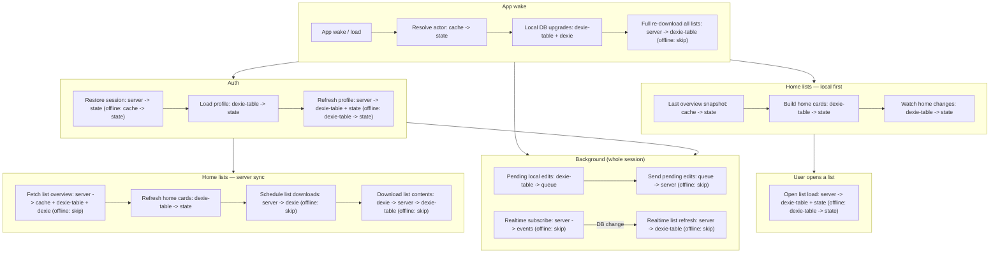

# App wake / load flow

**Arrows (solid only)**

| Arrow from | Meaning |
|------------|--------|
| **Inside a box** | Next step in that branch (full dependency). |
| **Subgraph border** | Partial dependency — needs something from that phase, not the last inner step only. |
| **No arrow** | No dependency; may still overlap in time. |

**Between containers:** at most **one** arrow per pair (target box is the whole phase, not a specific inner step).

| Type | Meaning |
|------|--------|
| **server** | Supabase |
| **cache** | localStorage |
| **state** | Zustand / React |
| **dexie-table** | IndexedDB entity tables |
| **dexie** | IndexedDB `meta` |
| **queue** | Outbound `sync_queue` rows |
| **events** | Realtime handlers |
| **skip** | Step not run offline |

**Between-container dependencies**

| Arrow | Meaning |
|-------|--------|
| `BOOT -->` Auth / local home / background | Actor resolved + Dexie restructure (schema ready; G16 optional, non-blocking). |
| `AUTH --> LISTS_SERVER` | **`get_user_lists` and mirror schedule** need signed-in `user` (`canFetchFromServerNow`). Guest or session-not-ready: server branch **skip**, Dexie-only warm only (via local home path). |
| `AUTH --> BACKGROUND` | Same signed-in `user` for realtime + outbound send. |
| `LISTS_LOCAL --> USER_OPEN` | Home list cards on screen before open-from-home. |
